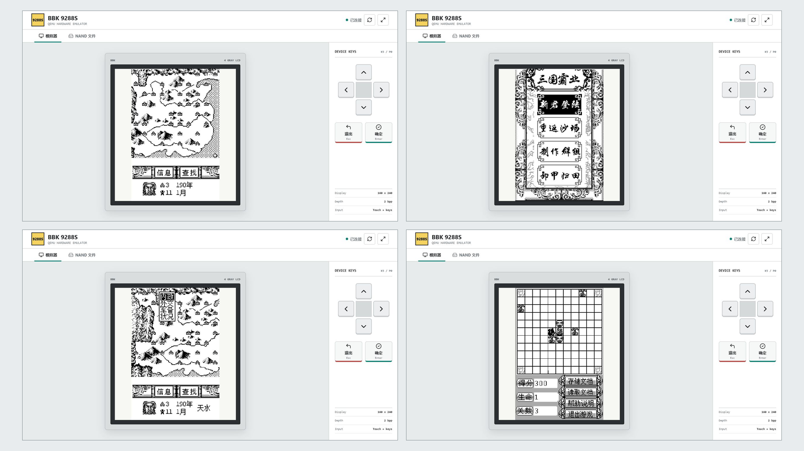

# BBK 9288S QEMU

基于 QEMU 11.0 的步步高 9288S 硬件模拟器。项目实现了 Epson
S1C33L05 CPU、9288S 板级外设、四灰阶 LCD、触摸/按键、持久化 NAND，
并提供可供局域网设备访问的 Web 控制台。

这是非官方逆向工程项目，与步步高、Epson 或 QEMU 项目没有隶属关系。



## 当前状态

- 板级加载器可从 NAND FAT16 中读取真实 `kernel.bin` 并完成启动。
- `160 x 240`、2 bpp、四灰阶 LCD 可正常显示。
- 触摸通过 FPT6、Timer3-B 和板级串行 ADC 硬件路径进入固件。
- 方向键通过 K5 GPIO，确定/退出通过 P0 GPIO 进入固件。
- Timer2-B 提供 GUI 和游戏需要的系统节拍。
- Samsung 兼容 `EC DA 10 95` NAND 支持读取、编程、擦除和退出保存。
- Web 端可以游玩固件自带的《三国霸业》和《海盗船》，并管理 NAND 文件。

触摸和按键只经过 QEMU 的 FPT、GPIO、串行 ADC 与定时器模型；源码不包含
guest 内存注入、系统 API 注入或应用级 hook。其余诊断属性只用于逆向研究，
默认全部关闭。

## 快速开始

当前 Release 面向 Windows x64。

1. 从 [Releases](https://github.com/HelloClyde/bbk9288s-qemu/releases) 下载
   `bbk9288s-qemu-*-windows-x64.zip`。
2. 下载同一 Release 中的 `bbk9288s-test-nand.zip`，解压到模拟器目录。
3. 安装 Python 3.11 或更高版本，并安装 NAND 管理依赖：

   ```powershell
   python -m pip install -r requirements-bbk9288s.txt
   ```

4. 双击 `run-bbk9288s-web.cmd`，或在 PowerShell 中运行：

   ```powershell
   .\run-bbk9288s-web.ps1
   ```

启动器会输出本机和局域网 URL。默认地址为
`http://127.0.0.1:8000/`。

启动时，板级加载器扫描 NAND OOB 中的 FTL 映射，挂接 FAT16，并在目录树
中寻找 `kernel.bin`；不再需要 NAND 之外的内核文件。测试 NAND 作为独立
Release 资产发布，不进入 Git 源码历史。请只使用你有权使用和分发的固件
与系统文件。

## 操作

| 9288S 输入 | 键盘 | Web 控件 |
| --- | --- | --- |
| 上 / 下 / 左 / 右 | 方向键 | 方向键 |
| 确定 | `Enter` / `Space` | 确定 |
| 退出 | `Esc` / `Backspace` | 退出 |
| 触摸屏 | 鼠标 | 直接触摸 LCD |

顶栏的电源按钮在设备关机时启动 QEMU，在设备运行时执行完整重启；旁边的
刷新按钮只重新连接当前显示会话。

首次启动会要求依次点击 `(16,24)`、`(144,216)`、`(80,120)` 三个校准点。
Web 前端会适度延长短触摸和短按键，使原固件的硬件去抖逻辑能够采样。

## NAND 文件

Web 控制台的 `NAND 文件` 页支持：

- 目录浏览和容量统计
- 多文件上传和文件下载
- 新建目录、重命名、删除
- 中文 VFAT 长文件名和固件 GBK 8.3 短文件名

编辑前需要进入维护模式。后端会通过 QMP 正常停止 QEMU，等待板级 NAND
模型保存 `nand-user.raw`，再提取 FAT16 文件系统。

- `应用并重启`：修补 GBK 短文件名，重新生成 FTL/OOB 并启动 QEMU。
- `放弃`：丢弃暂存文件系统，不修改 NAND。

不要在 QEMU 运行时用外部工具编辑 `nand-user.raw`，也不要强杀 QEMU；
未正常退出时，最后一部分 guest 写入可能尚未保存。

## 运行目录

源码构建默认使用源码树旁边的 `eebbk9288s-runtime`：

```text
E:\
├─ eebbk9288s-qemu\
└─ eebbk9288s-runtime\
   ├─ nand-user.raw
   └─ web-qemu.stderr.log
```

Release 解压版默认使用包内的 `runtime`。可以通过参数或环境变量改写：

```powershell
.\run-bbk9288s-web.ps1 -RuntimeDir D:\9288s-data
$env:BBK9288S_RUNTIME_DIR = 'D:\9288s-data'
```

这样重新配置或清理 QEMU 构建目录不会删除 NAND 和固件。

## 源码构建

依赖：

- Windows 10/11 x64
- MSYS2 UCRT64
- Node.js 20+
- Python 3.11+

在 MSYS2 UCRT64 中安装基本构建依赖：

```bash
pacman -S --needed base-devel git diffutils \
  mingw-w64-ucrt-x86_64-toolchain \
  mingw-w64-ucrt-x86_64-glib2 \
  mingw-w64-ucrt-x86_64-pixman \
  mingw-w64-ucrt-x86_64-zlib \
  mingw-w64-ucrt-x86_64-ninja \
  mingw-w64-ucrt-x86_64-python
```

从 PowerShell 配置和构建最小 Web 版本：

```powershell
New-Item -ItemType Directory -Force _build | Out-Null
$env:CHERE_INVOKING = '1'
$env:MSYSTEM = 'UCRT64'
Push-Location _build
& C:\msys64\usr\bin\bash.exe -lc '../configure --target-list=s1c33-softmmu --without-default-features --enable-tcg --enable-vnc --enable-pixman --disable-werror --disable-docs --disable-tools'
& C:\msys64\usr\bin\bash.exe -lc 'ninja qemu-system-s1c33.exe'
Pop-Location
```

构建 Web 前端：

```powershell
Push-Location web
npm ci
npm run build
Pop-Location
```

之后运行 `run-bbk9288s-web.ps1`。启动器会优先查找根目录 Release
二进制，其次查找 `build` 和 `_build`。

## 发布

`.github/workflows/release.yml` 在推送 `v*` tag 时：

1. 构建 Vite/noVNC 前端。
2. 在 MSYS2 UCRT64 中构建最小 QEMU Windows x64 二进制。
3. 递归收集所需 MSYS2 DLL。
4. 生成 ZIP、文件清单和 SHA-256。
5. 创建 GitHub Release。
6. 如果 `nand-test-image` Release 已存在，则附带测试 NAND 资产。

首次或更新测试 NAND 时，在仓库根目录运行：

```powershell
.\scripts\publish-bbk9288s-nand.ps1 `
  -NandPath E:\eebbk9288s-runtime\nand-user.raw `
  -Repository HelloClyde/bbk9288s-qemu
```

该脚本会验证 NAND 大小、压缩镜像、生成 SHA-256，并上传到
`nand-test-image` prerelease。NAND 不会被提交到 Git。

## 实现位置

- `target/s1c33/`：S1C33 CPU 状态、TCG 翻译、异常、中断和反汇编。
- `hw/s1c33/bbk9288s.c`：9288S 内存映射和板级硬件模型。
- `scripts/bbk9288s_nand_image.py`：NAND FTL/OOB 提取、打包和系统安装。
- `scripts/bbk9288s_web_server.py`：QEMU 生命周期、QMP 和 NAND 文件 API。
- `web/`：Vite + noVNC Web 控制台。
- `plan.md`：逆向过程、验证证据和后续工作。
- `docs/technical-notes.md`：详细寄存器、调试属性和实验记录。

## 安全

WebSocket 和 NAND HTTP API 默认没有认证或 TLS，只应暴露在可信局域网。
QMP 固定监听 `127.0.0.1`。不要把 `8000` 或 `6081` 端口直接映射到公网。

安全问题请参考 [SECURITY.md](SECURITY.md)。

## 许可

本仓库是 QEMU 的修改版本，遵循上游相应的 GPL-2.0 和 LGPL-2.1
许可，详见 [LICENSE](LICENSE)、[COPYING](COPYING) 和
[COPYING.LIB](COPYING.LIB)。

`kernel.bin`、NAND 镜像和 NAND 内文件不因本仓库源码许可而自动获得
重新分发授权。发布者和使用者需要自行确认相关权利。

硬件研究参考：

- [Epson S1C33L05 Technical Manual](https://global.epson.com/products_and_drivers/semicon/pdf/id000276.pdf)
- [QEMU](https://www.qemu.org/)
